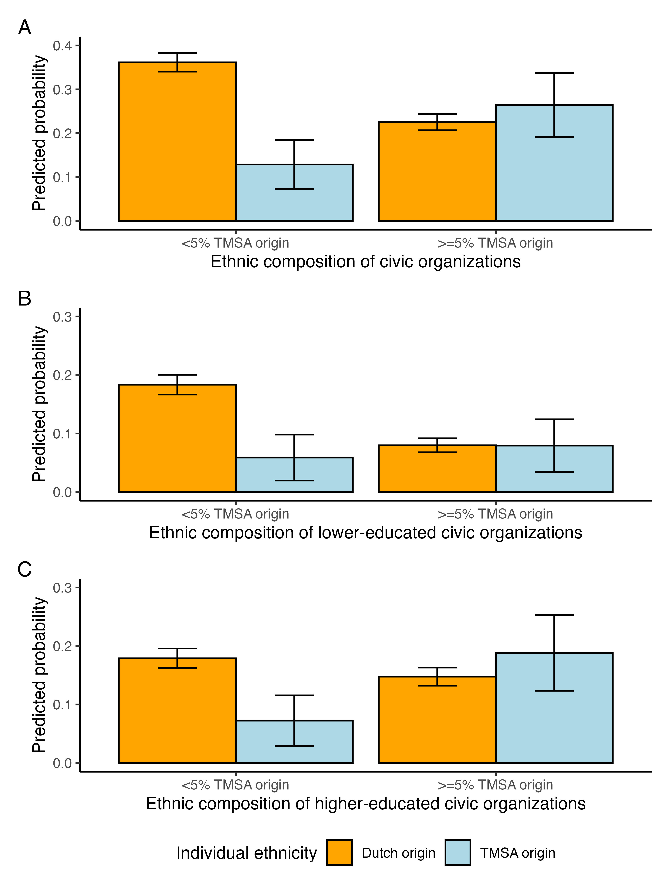
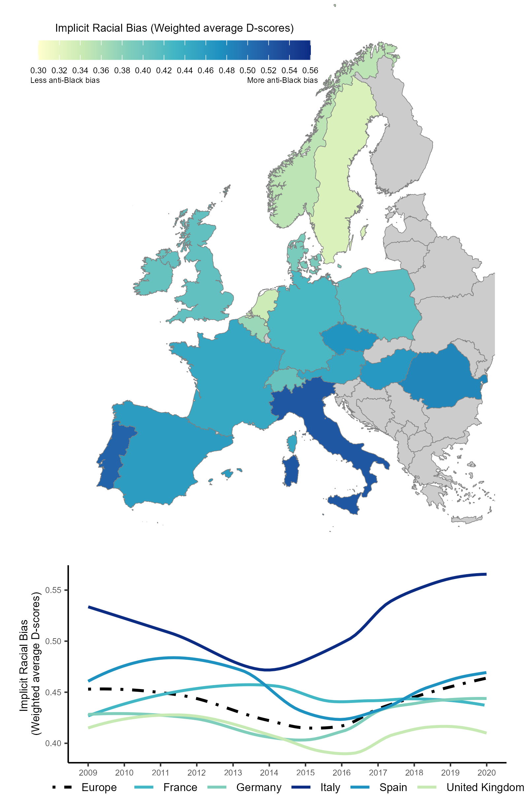
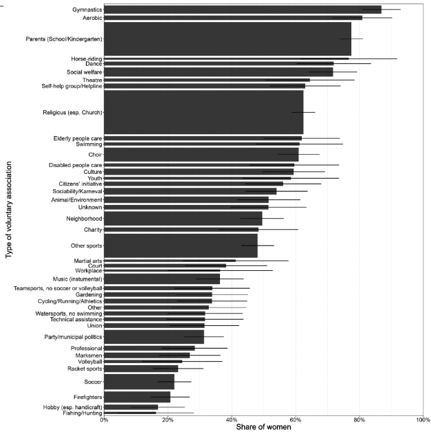

# Dederichs, K. & D. Wiertz ([2025](https://doi.org/10.1093/esr/jcae047)) Brittle bridges: ethnic segregation across and within civic organizations - European Sociological Review 

Civic organizations are often depicted as vehicles for social integration: Since they gather people around common interests and have relatively low entry barriers, they may facilitate interactions that bridge social divides prevailing in other domains. However, this hopeful portrayal rests on several critical yet largely untested assumptions. This study more closely investigates the bridging potential of civic organizations, focusing on ethnicity as a key social boundary. Using unique Dutch survey data, we show that: (i) There is strong ethnic segregation across civic organizations, which persists after accounting for educational differences between individuals and organizations; (ii) There is ethnic segregation within civic organizations in participants’ contacts with co-members; (iii) Participants integrate less well in organizations with more ethnic outgroup members and are more likely to leave such organizations. In sum, homophilous sorting dynamics when people join, interact within, and leave civic organizations limit their capacity to facilitate positive inter-ethnic contact. Additional efforts are thus necessary for civic organizations to fully live up to their bridging potential and mitigate rather than reinforce existing ethnic divides. ([code](https://github.com/kasimirdederichs/Ethnic_Segregation_Civic_Organizations))

  

# Dederichs, K. & P. Verhaeghe ([2024](https://doi.org/10.1093/esr/jcae047)) Implicit Racial Bias in Europe: Cross-National Variation and Time Trends - Socius

The authors visualize how implicit racial bias at the collective level varies across European countries and how it changed between 2009 and 2019. To obtain population-level estimates, the authors re-weight implicit association test data from the Project Implicit international dataset (n = 184,745). Implicit bias against Black people is stronger in southern and eastern vis-à-vis northern and western European countries. It decreased until the mid-2010s but started to increase thereafter. ([code](https://github.com/kasimirdederichs/Implicit_Racial_Bias_In_Europe))

  

# Dederichs, K. ([2024](https://doi.org/10.1016/j.socnet.2023.07.004)) Join to connect? Voluntary involvement, social capital, and socioeconomic inequalities - Social Networks

Access to social capital is stratified by socioeconomic status and has been cross-sectionally linked to involvement in voluntary organizations. Yet, we know little about the origin and interplay of these empirical regularities. Regression analyses on German panel data (SC6-NEPS) reveal that people rich in social capital join organizations more often (selection). Furthermore, joiners access more and higher-status social capital after joining (socializing opportunities). Low-status individuals disproportionally extend their reach towards higher positions through involvement but join less often. Compared to a counterfactual situation in which nobody joins, current involvement patterns marginally reduce some socioeconomic inequalities in access to social capital. ([code](https://github.com/kasimirdederichs/Volunteering_SocialCapital_SES))

  

# Dederichs, K. & de Graaf, N.D. ([2023](https://doi.org/10.1177/08912432231195075)) Gender Segregation in Civic Life: Women’s and Men’s Involvement in Voluntary Associations - Gender & Society

The pervasive persistence of gender segregation has been documented in a myriad of social settings, implying that women and men primarily encounter peers of their own gender in daily life. While voluntary associations are often praised for their ability to bridge other social divides, previous research indicates substantive gender disparities in voluntary involvement. Yet we still know relatively little about the extent and origins of gender segregation in civic life. In this article, we study gender homophily in voluntary involvement and examine how structural features of friendship networks and traditional gender norms bring about gender segregation. Employing data from a German panel study (SC6-NEPS), we analyze cross-sectional patterns of gender segregation and run multinomial and binary logistic regressions to model joining and quitting transitions. Our results indicate substantive gender segregation across and within types of voluntary associations. The overall gender segregation is driven by homophilous transitions into associational contexts, not by selective quitting decisions. Gender-segregated friendship networks partially explain the tendency to join organizations dominated by one’s own gender. Traditional gender norms are associated with more homophilous joining transitions among men, but not among women. Overall, these findings imply that civic life perpetuates the structural significance of gender. ([code](https://github.com/kasimirdederichs/GenderSegregation_CivicLife))

  

# Dederichs, K. & Kruse, H. ([2023](https://academic.oup.com/esr/advance-article-abstract/doi/10.1093/esr/jcac013/6529441)) Who Stays Involved? A Longitudinal Study on Adolescents’ Participation in Voluntary Associations in Germany - European Sociological Review 

The extent to which people are active in voluntary associations varies with age. While previous research provides clear evidence for an inverse u-shaped pattern across an adult’s life, much less is known about the formative period of adolescence and young adulthood. In this article, we examine changes in voluntary participation starting at age 14 and assess the impact of adolescents’ educational transitions and their socioeconomic status. Our analyses rely on longitudinal survey data following a representative sample of adolescents in Germany (N = 5,013) over 6 years. Using fixed effects regression and moderated mediation analyses, we examine how adolescents’ educational transitions and their socioeconomic status drive changes in participation. Results indicate a substantive decline in participation as individuals grow older. Transitions into higher tertiary education partly account for this decline. Finally, we find that adolescents from higher socioeconomic status are especially likely to reduce their participation, in part because they are more likely to undergo transitions into higher tertiary education. These findings suggest that the socioeconomic gap in participation decreases as adolescents grow older. ([code](https://github.com/kasimirdederichs/Who_stays_involved)) 

  

# Dederichs, K. ([2022](https://journals.sagepub.com/doi/full/10.1177/08997640221122814#table-fn2-08997640221122814)) Volunteering in the United Kingdom During the COVID-19 Pandemic: Who Started and Who Quit? - Nonprofit and Voluntary Sector Quarterly 

I examine how volunteering dynamics changed in the United Kingdom during the coronavirus disease 2019 (COVID-19) pandemic relying on data from the “Understanding Society” survey. Descriptive analyses and linear probability models yield three main findings: First, the share of volunteers (for all causes) dropped at least by a third during the first lockdown and did not increase until March 2021. Second, disproportional (absolute) declines occurred among the elderly, women, and those with higher education. Elderly individuals were particularly likely to quit their voluntary engagement, while the propensity of starting declined particularly among higher educated individuals. Third, volunteering in response to COVID-19 was performed by only 3.4% of all respondents and was more common among the higher educated, women, and experienced volunteers. These results suggest that volunteering might well decrease during disasters that affect the opportunities of potential volunteers contrasting the mobilizing role of disasters highlighted by earlier research. ([code](https://github.com/kasimirdederichs/Volunteering_COVID))

